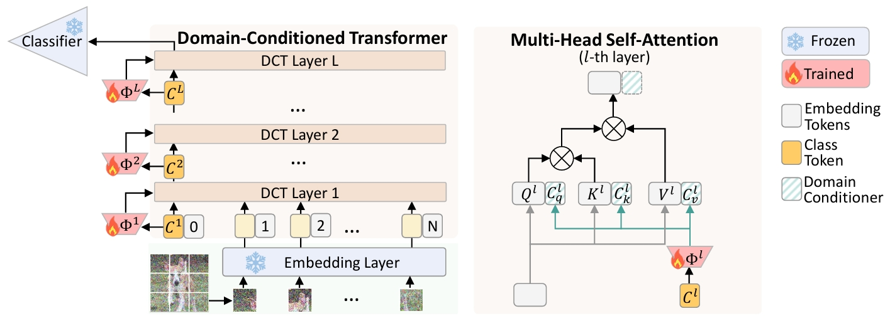

# Domain-Conditioned Transformer for Fully Test-time Adaptation

This is the official project repository for [Domain-Conditioned Transformer for Fully Test-time Adaptation]. This repository is built based on the [SAR 🔗](https://github.com/mr-eggplant/SAR).

<p align="center">

</p>


**Installation**:

DCT depends on

- Python 3
- [PyTorch](https://pytorch.org/) = 1.9.0
- [timm](https://github.com/rwightman/pytorch-image-models)==0.6.11


This repository contains code for evaluation on ImageNet-C, ImageNet-R, and VisDA-2021 with ViT.


**Usage**:

```
bash run.sh
```

## Acknowledgment
The code is inspired by the [Tent 🔗](https://github.com/DequanWang/tent) and [SAR 🔗](https://github.com/mr-eggplant/SAR).
